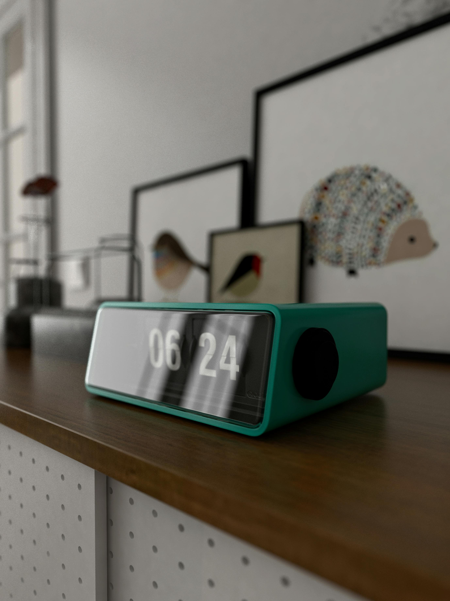
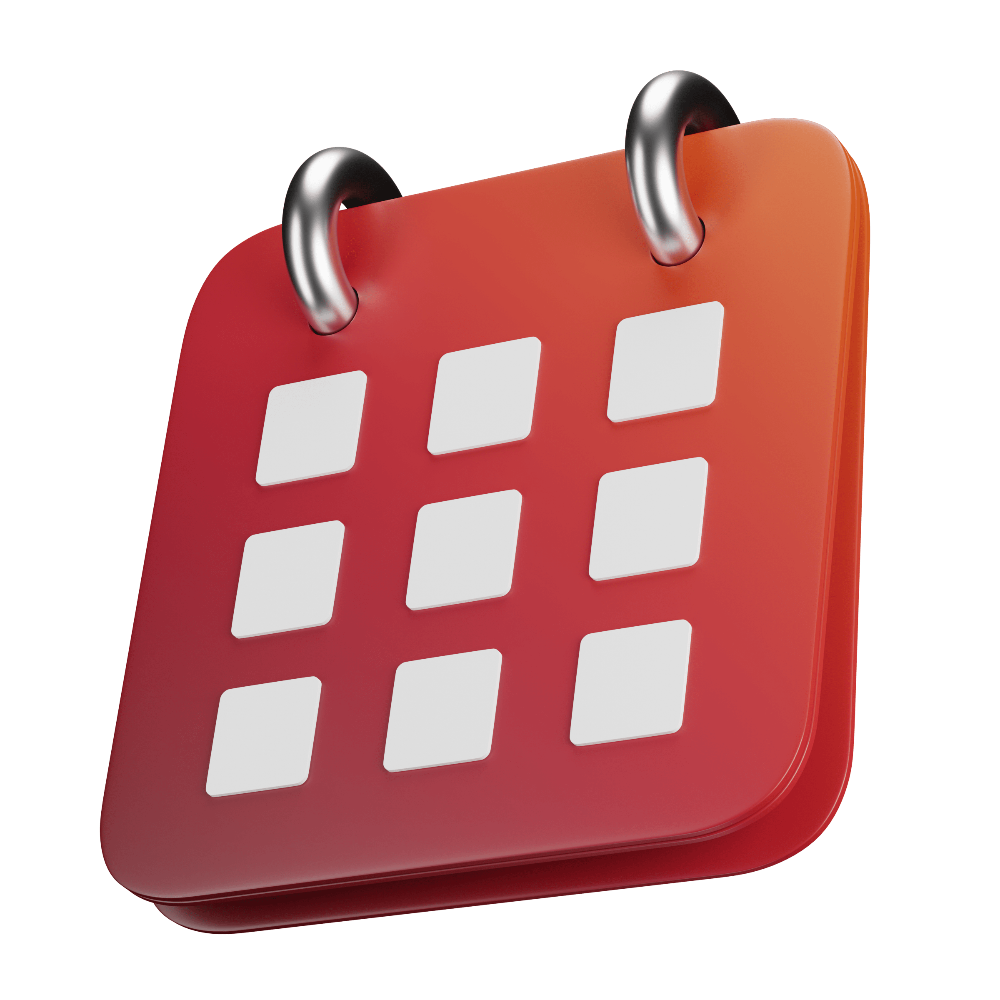
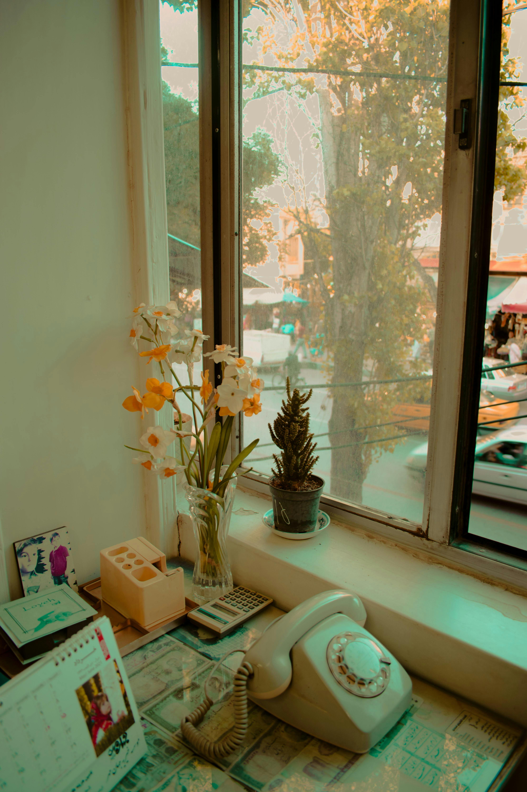

# Vanilla JS Projects Portfolio 🚀

A comprehensive collection of 30+ pure vanilla JavaScript projects showcasing modern web development techniques, interactive UI components, and creative implementations.


## 📋 Table of Contents

- [About](#about)
- [Tech Stack](#tech-stack)
- [Projects](#projects)
- [Getting Started](#getting-started)
- [Project Structure](#project-structure)
- [Contributing](#contributing)
- [License](#license)

## 🎯 About

This repository contains a curated collection of vanilla JavaScript projects built without frameworks or libraries. Each project demonstrates different concepts, from basic DOM manipulation to complex API integrations and interactive animations.

**Live Demo:** [View Portfolio](https://avatarn03.github.io/vanillaJs_Collections_Projects-2/) <!-- Add your deployed link -->

## 🛠️ Tech Stack

<div align="center">


</div>

- **HTML5** - Semantic markup and structure
- **CSS3** - Modern styling, animations, and responsive design
- **Vanilla JavaScript (ES6+)** - Pure JavaScript with no frameworks
- **GSAP** - GreenSock Animation Platform for advanced animations
- **Web APIs** - Fetch API, LocalStorage, Date/Time APIs

## 🎨 Projects

### ⏰ Time & Date Projects

<table>
  <tr>
    <td width="50%">
      <h3 align="center">Analog Clock</h3>
      <div align="center">
        
        <p><strong>Features:</strong> Real-time analog clock with smooth animations</p>
        <a href="./projects/Analog-Clock/">View Code</a>
      </div>
    </td>
    <td width="50%">
      <h3 align="center">Digital Clock</h3>
      <div align="center">
        
        <p><strong>Features:</strong> Modern digital time display with date</p>
        <a href="./projects/DigitalClock/">View Code</a>
      </div>
    </td>
  </tr>
  <tr>
    <td width="50%">
      <h3 align="center">Mini Calendar</h3>
      <div align="center">
        
        <p><strong>Features:</strong> Compact calendar widget with current date</p>
        <a href="./projects/Mini-Calender/">View Code</a>
      </div>
    </td>
    <td width="50%">
      <h3 align="center">Age Calculator</h3>
      <div align="center">
        
        <p><strong>Features:</strong> Calculate age in years, months, and days</p>
        <a href="./projects/Age-Calculator/">View Code</a>
      </div>
    </td>
  </tr>
  <tr>
    <td width="50%">
      <h3 align="center">Counter Timer</h3>
      <div align="center">
        
        <p><strong>Features:</strong> Customizable countdown timer</p>
        <a href="./projects/Counter-Timer/">View Code</a>
      </div>
    </td>
    <td width="50%">
      <h3 align="center">Realtime Character Counter</h3>
      <div align="center">
        
        <p><strong>Features:</strong> Live character and word counting</p>
        <a href="./projects/Realtime-Character-Count/">View Code</a>
      </div>
    </td>
  </tr>
</table>

### 🎮 Interactive & Animation Projects

<table>
  <tr>
    <td width="50%">
      <h3 align="center">Drum Kit</h3>
      <div align="center">
        
        <p><strong>Features:</strong> Interactive drum kit with sound effects</p>
        <a href="./projects/Drum-Kit/">View Code</a>
      </div>
    </td>
    <td width="50%">
      <h3 align="center">Memory Flash Game</h3>
      <div align="center">
        
        <p><strong>Features:</strong> Memory pattern matching game</p>
        <a href="./projects/MemoryFlash/">View Code</a>
      </div>
    </td>
  </tr>
  <tr>
    <td width="50%">
      <h3 align="center">Cursor Animation</h3>
      <div align="center">
        
        <p><strong>Features:</strong> Custom animated cursor effects</p>
        <a href="./projects/Cursor_Animation/">View Code</a>
      </div>
    </td>
    <td width="50%">
      <h3 align="center">Ring Trail Effect</h3>
      <div align="center">
        
        <p><strong>Features:</strong> Animated ring trail following cursor</p>
        <a href="./projects/RingTrail/">View Code</a>
      </div>
    </td>
  </tr>
  <tr>
    <td width="50%">
      <h3 align="center">Button Ripple Effect</h3>
      <div align="center">
        
        <p><strong>Features:</strong> Material design ripple animation</p>
        <a href="./projects/Button-Ripple-Effect/">View Code</a>
      </div>
    </td>
    <td width="50%">
      <h3 align="center">Rotating Image Gallery</h3>
      <div align="center">
        
        <p><strong>Features:</strong> 3D rotating image carousel</p>
        <a href="./projects/Rotating-Image-Gallery/">View Code</a>
      </div>
    </td>
  </tr>
  <tr>
    <td width="50%">
      <h3 align="center">Auto Text Animation</h3>
      <div align="center">
        
        <p><strong>Features:</strong> Typewriter text animation effect</p>
        <a href="./projects/Auto-Text-Animation/">View Code</a>
      </div>
    </td>
    <td width="50%">
      <h3 align="center">Background Scroll Effect</h3>
      <div align="center">
        
        <p><strong>Features:</strong> Parallax scrolling background</p>
        <a href="./projects/Background-Scroll-Effect/">View Code</a>
      </div>
    </td>
  </tr>
</table>

### 🎨 UI Components & Tools

<table>
  <tr>
    <td width="50%">
      <h3 align="center">Dark Mode Toggle</h3>
      <div align="center">
        
        <p><strong>Features:</strong> Theme switcher with local storage</p>
        <a href="./projects/Dark-Mode/">View Code</a>
      </div>
    </td>
    <td width="50%">
      <h3 align="center">Random Color Generator</h3>
      <div align="center">
        
        <p><strong>Features:</strong> Generate random hex colors</p>
        <a href="./projects/Random-Color-Generator/">View Code</a>
      </div>
    </td>
  </tr>
  <tr>
    <td width="50%">
      <h3 align="center">Animated Search Icon</h3>
      <div align="center">
        
        <p><strong>Features:</strong> Expandable search bar animation</p>
        <a href="./projects/Animated-Search-Icon/">View Code</a>
      </div>
    </td>
    <td width="50%">
      <h3 align="center">Filter Gallery</h3>
      <div align="center">
        
        <p><strong>Features:</strong> Filterable image gallery with categories</p>
        <a href="./projects/Filter-Gallery/">View Code</a>
      </div>
    </td>
  </tr>
</table>

### 📱 API Integration Projects

<table>
  <tr>
    <td width="50%">
      <h3 align="center">Image Search</h3>
      <div align="center">
        
        <p><strong>Features:</strong> Search images using Unsplash API</p>
        <a href="./projects/Image-Search/">View Code</a>
      </div>
    </td>
    <td width="50%">
      <h3 align="center">Random Meme Generator</h3>
      <div align="center">
        
        <p><strong>Features:</strong> Fetch random memes from API</p>
        <a href="./projects/Random-Meme/">View Code</a>
      </div>
    </td>
  </tr>
  <tr>
    <td width="50%">
      <h3 align="center">Emoji API</h3>
      <div align="center">
        
        <p><strong>Features:</strong> Display random emojis with descriptions</p>
        <a href="./projects/Emoji-API/">View Code</a>
      </div>
    </td>
    <td width="50%"></td>
  </tr>
</table>

### 💼 Productivity Apps

<table>
  <tr>
    <td width="50%">
      <h3 align="center">Todo List</h3>
      <div align="center">
        
        <p><strong>Features:</strong> Task manager with local storage</p>
        <a href="./projects/Todo-List/">View Code</a>
      </div>
    </td>
    <td width="50%">
      <h3 align="center">Expense Tracker</h3>
      <div align="center">
        
        <p><strong>Features:</strong> Track income and expenses</p>
        <a href="./projects/Expense_Tracker/">View Code</a>
      </div>
    </td>
  </tr>
</table>

### 🌐 Web Pages & Clones

<table>
  <tr>
    <td width="50%">
      <h3 align="center">Lucy Education</h3>
      <div align="center">
        
        <p><strong>Features:</strong> Educational website landing page</p>
        <a href="./projects/Lucy-Education/">View Code</a>
      </div>
    </td>
    <td width="50%">
      <h3 align="center">Miranda Clone</h3>
      <div align="center">
        
        <p><strong>Features:</strong> Animated portfolio website clone</p>
        <a href="./projects/Miranda-Clone/">View Code</a>
      </div>
    </td>
  </tr>
  <tr>
    <td width="50%">
      <h3 align="center">Shoes Website</h3>
      <div align="center">
        
        <p><strong>Features:</strong> E-commerce product showcase</p>
        <a href="./projects/Shoes-Website/">View Code</a>
      </div>
    </td>
    <td width="50%">
      <h3 align="center">Ramufy Music Player</h3>
      <div align="center">
        
        <p><strong>Features:</strong> Custom music player with playlist</p>
        <a href="./projects/Ramufy/">View Code</a>
      </div>
    </td>
  </tr>
  <tr>
    <td width="50%">
      <h3 align="center">Video Popup</h3>
      <div align="center">
        
        <p><strong>Features:</strong> Modal video player popup</p>
        <a href="./projects/Video-Pop/">View Code</a>
      </div>
    </td>
    <td width="50%"></td>
  </tr>
</table>

## 🚀 Getting Started

### Prerequisites

- A modern web browser (Chrome, Firefox, Safari, Edge)
- A code editor (VS Code, Sublime Text, etc.)
- Basic knowledge of HTML, CSS, and JavaScript

### Installation

1. Clone the repository
```bash
git clone https://github.com/AvatarN03/vanillaJs_Collections_Projects-2.git
```

2. Navigate to the project directory
```bash
cd vanillaJs_Collections_Projects-2
```

3. Open any project
```bash
cd projects/Project-Name
```

4. Open `index.html` in your browser or use a live server

### Running with Live Server

If you're using VS Code:
1. Install the "Live Server" extension
2. Right-click on `index.html`
3. Select "Open with Live Server"

## 📁 Project Structure

```
vanilla-js-projects/
├── assets/              # Images and icons for projects
├── projects/            # Individual project folders
│   ├── Project-Name/
│   │   ├── index.html
│   │   ├── style.css
│   │   ├── main.js
│   │   └── config.js (if needed)
├── index.html          # Main portfolio page
├── projects.html       # Projects listing page
├── about.html          # About page
├── style.css           # Main stylesheet
├── gsap.js             # GSAP animations
├── render.js           # Dynamic content rendering
└── projects.json       # Projects data
```

## 🎯 Key Features

- ✅ **Pure Vanilla JavaScript** - No frameworks or dependencies
- ✅ **Responsive Design** - Works on all devices
- ✅ **Modern ES6+ Syntax** - Arrow functions, destructuring, modules
- ✅ **Local Storage Integration** - Persistent data storage
- ✅ **API Integration** - Fetch API implementation
- ✅ **CSS Animations** - Smooth transitions and effects
- ✅ **GSAP Animations** - Advanced animation library
- ✅ **Clean Code** - Well-organized and commented

## 🤝 Contributing

Contributions are welcome! Here's how you can help:

1. Fork the repository
2. Create a new branch (`git checkout -b feature/AmazingFeature`)
3. Make your changes
4. Commit your changes (`git commit -m 'Add some AmazingFeature'`)
5. Push to the branch (`git push origin feature/AmazingFeature`)
6. Open a Pull Request

### Contribution Guidelines

- Follow existing code style and structure
- Add comments to explain complex logic
- Test your changes across different browsers
- Update README if you add new projects

## 📝 License

This project is licensed under the MIT License - see the [LICENSE](LICENSE) file for details.

## 👨‍💻 Author

**Your Name**

- GitHub: [@yourusername](https://github.com/AvatarN03)
- LinkedIn: [Your Name]([https://linkedin.com/in/yourprofile](https://www.linkedin.com/in/prashanth-naidu03/))

## 🙏 Acknowledgments

- Icons from [Font Awesome](https://fontawesome.com/)
- Images from [Unsplash](https://unsplash.com/)
- Animations powered by [GSAP](https://greensock.com/gsap/)
- Inspiration from the JavaScript community

## 📧 Contact

Have questions or suggestions? Feel free to reach out!

- Email: jsprashanth003@gmail.com


---

<div align="center">

**⭐ Star this repository if you find it helpful!**

Made with ❤️ using Vanilla JavaScript

</div>
